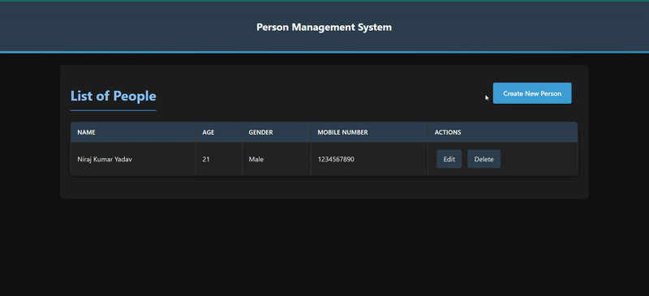

# Person REST API

This project is a RESTful web service built using Node.js and MongoDB to manage a collection of people. It provides endpoints to create, read, update, and delete person records.

## Live Demo



## Features

- **GET /person**: Displays a table with a list of people.
- **POST /person**: Displays a form to create a new person.
- **PUT /person/{id}**: Displays a form to edit an existing person by ID.
- **DELETE /person/{id}**: Displays a confirmation page to delete a person by ID.

## Project Structure

```
person-rest-api
├── src
│   ├── controllers          # Contains the logic for handling requests
│   │   └── personController.js
│   ├── models               # Defines the data structure for the Person collection
│   │   └── personModel.js
│   ├── routes               # Defines the API endpoints
│   │   └── personRoutes.js
│   ├── views                # Contains EJS templates for rendering HTML
│   │   ├── list.ejs
│   │   ├── create.ejs
│   │   ├── edit.ejs
│   │   └── delete.ejs
│   ├── config               # Configuration files
│   │   └── database.js
│   │   
│   ├── public               # Static assets
│   │   └── styles.css       # Dark-themed modern UI styling
│   │
│   └── app.js               # Entry point of the application
├── package.json             # NPM package configuration
├── .env                     # Environment variables
├── .gitignore               # Files and directories to ignore in Git
├── output.gif               # Demo animation of the application
└── README.md                # Project documentation
```

## Technologies Used

- **Node.js**: JavaScript runtime environment
- **Express.js**: Web application framework
- **MongoDB Atlas**: Cloud database service
- **Mongoose**: MongoDB object modeling
- **EJS**: Templating engine for dynamic views
- **Method-Override**: For handling PUT and DELETE requests

## Installation

1. Clone the repository:
   ```
   git clone https://github.com/nirajkumaryadav/person-rest-api.git
   ```

2. Navigate to the project directory:
   ```
   cd person-rest-api
   ```

3. Install the dependencies:
   ```
   npm install
   ```

4. Set up your MongoDB connection string in the `.env` file:
   ```
   MONGODB_URI=<your-mongodb-connection-string>
   ```

## Usage

1. Start the server:
   ```
   npm start
   ```

2. Open your browser and navigate to `http://localhost:3000/person` to view the list of people.

## UI Features

- Modern dark theme interface
- Responsive design that works on mobile and desktop
- Smooth animations and transitions
- Intuitive navigation
- Form validation for data integrity

## API Endpoints

| Method | Endpoint | Description |
|--------|----------|-------------|
| GET | /person | Displays a table with list of all people |
| GET | /person/create | Displays form to create a new person |
| POST | /person | Creates a new person record |
| GET | /person/:id/edit | Displays form to edit an existing person |
| PUT | /person/:id | Updates an existing person record |
| GET | /person/:id/delete | Displays delete confirmation page |
| DELETE | /person/:id | Deletes a person record |


